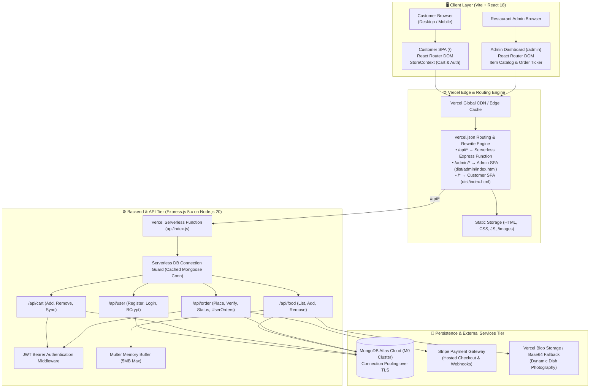
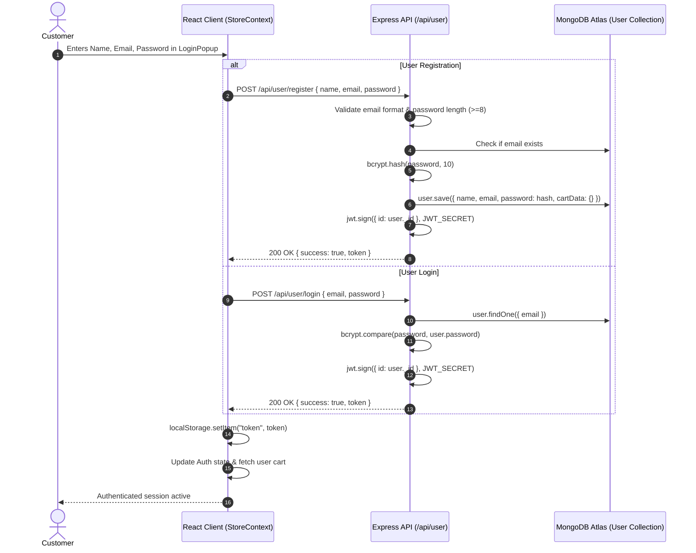
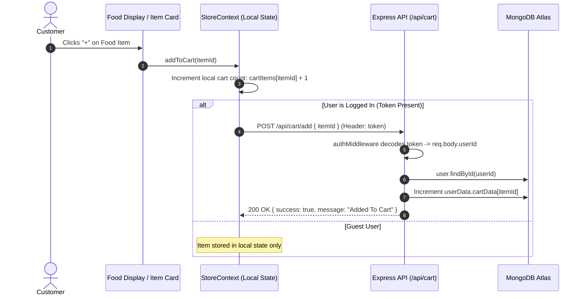
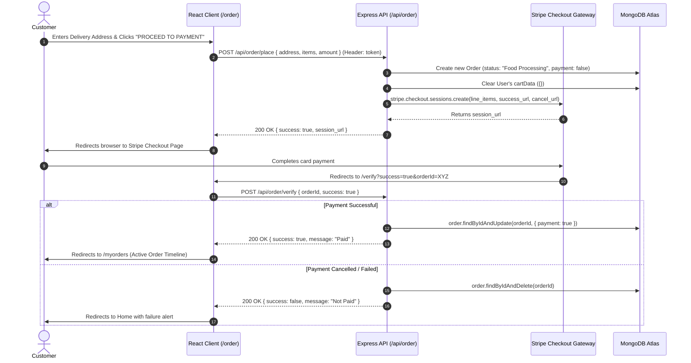
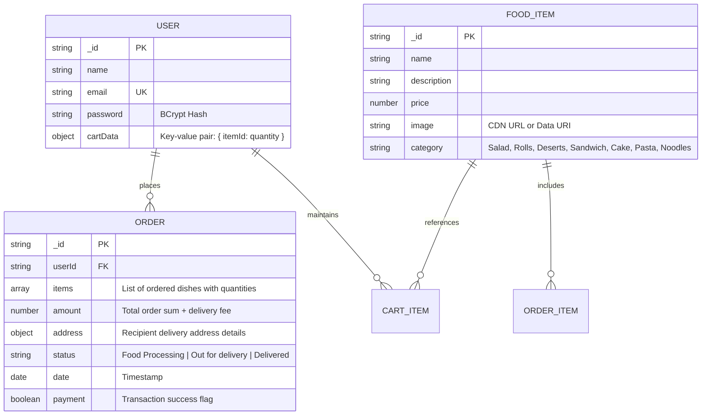
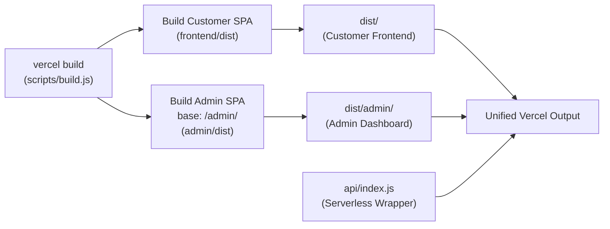

# 🍽️ Casa Lasa — Full-Stack Food Delivery Platform

[](https://nodejs.org/)
[](https://expressjs.com/)
[](https://react.dev/)
[](https://vitejs.dev/)
[](https://www.mongodb.com/atlas)
[](https://mongoosejs.com/)
[](https://stripe.com/)
[](https://vercel.com/)

**Casa Lasa** is a modern, production-ready, full-stack food delivery web platform engineered using the **MERN** (MongoDB, Express, React, Node.js) stack. Designed with a clean decoupled client-server architecture, Casa Lasa brings a seamless customer ordering experience together with a dedicated management portal for restaurant administrators and secured Stripe payment processing. The entire monorepo is packaged for zero-downtime, unified serverless deployment on **Vercel**.

---

## 📑 Table of Contents

1. [High-Level System Architecture](#-high-level-system-architecture)
2. [End-to-End Architectural Ecosystem](#-end-to-end-architectural-ecosystem)
3. [Architecture Tiers & Component Breakdown](#-architecture-tiers--component-breakdown)
   - [Customer Frontend Tier (Client Layer)](#1-customer-frontend-tier-client-layer)
   - [Admin Dashboard Tier (Management Layer)](#2-admin-dashboard-tier-management-layer)
   - [Backend Application & API Tier (Serverless Layer)](#3-backend-application--api-tier-serverless-layer)
   - [Database & Cloud Storage Tier (Persistence Layer)](#4-database--cloud-storage-tier-persistence-layer)
   - [Payment Gateway Tier (Financial Layer)](#5-payment-gateway-tier-financial-layer)
4. [Data Flow & Sequence Workflows](#-data-flow--sequence-workflows)
   - [User Authentication & Session Lifecycle](#1-user-authentication--session-lifecycle)
   - [Cart Synchronization Workflow](#2-cart-synchronization-workflow)
   - [Order Placement & Stripe Payment Verification](#3-order-placement--stripe-payment-verification)
   - [Admin Menu Item Management & Media Pipeline](#4-admin-menu-item-management--media-pipeline)
5. [Database Schema & Data Model](#-database-schema--data-model)
   - [Entity-Relationship Diagram (ERD)](#entity-relationship-diagram-erd)
   - [Mongoose Model Specifications](#mongoose-model-specifications)
6. [Complete Project Monorepo Structure](#-complete-project-monorepo-structure)
7. [API Endpoint Reference](#-api-endpoint-reference)
   - [User Authentication (`/api/user`)](#1-user-authentication-apiuser)
   - [Food Catalog Management (`/api/food`)](#2-food-catalog-management-apifood)
   - [Cart Operations (`/api/cart`)](#3-cart-operations-apicart)
   - [Orders & Transactions (`/api/order`)](#4-orders--transactions-apiorder)
8. [Environment Variables Matrix](#-environment-variables-matrix)
9. [Serverless Architecture & Unified Build Automation](#-serverless-architecture--unified-build-automation)
10. [Local Development Setup](#-local-development-setup)
11. [Production Deployment Guide](#-production-deployment-guide)

---

## 🏛️ High-Level System Architecture

The following diagram illustrates how customer requests and administrative commands traverse through the edge layer, Vercel routing rules, stateless Express serverless functions, and persistent cloud services:



---

## 🌐 End-to-End Architectural Ecosystem

Casa Lasa is engineered around five fundamental architectural tenets:

1. **Decoupled Single-Page Applications**: Independent build targets for Customer and Administrative experiences, compiled together through an automated monorepo assembly script (`scripts/build.js`).
2. **Stateless Serverless Execution**: An Express REST API running seamlessly on Vercel Serverless Functions with cached MongoDB connection pooling to prevent connection exhaustion.
3. **Resilient Cart Synchronization**: Hybrid client-side and server-side cart state. Guest carts are stored in memory/context, and seamlessly reconciled to MongoDB once authenticated.
4. **End-to-End Payment Integrity**: Stripe Checkout handles PCI-DSS compliant transactions. Order status transitions from `Food Processing` to `Out for Delivery` and `Delivered` with payment verification.
5. **Universal Image Pipeline**: In-memory buffer ingestion using `multer` that intelligently routes uploads to `@vercel/blob` in cloud production, falling back to data URIs or disk storage in local development.

---

## 🧱 Architecture Tiers & Component Breakdown

### 1. Customer Frontend Tier (Client Layer)
* **Framework**: React 18 with Vite 6.
* **State Management**: Centralized `StoreContext` handling shopping cart operations, live food catalog caching, and persistent user authentication state.
* **Routing**: `react-router-dom` v7 with customer-focused views:
  * `/` — Dynamic homepage with interactive category filter (`ExploreMenu`), hero banners, and menu grid.
  * `/cart` — Detailed cart inspector with quantity mutators, subtotal calculations, and checkout transitions.
  * `/order` — Delivery address entry form with phone validation and Stripe checkout integration.
  * `/verify` — Post-payment redirect handler validating Stripe session IDs and payment results.
  * `/myorders` — Real-time order tracker displaying status timeline, item counts, and live statuses.
* **UI Features**: Responsive mobile navigation, animated login/register modal popup, toast feedback via `react-toastify`.

### 2. Admin Dashboard Tier (Management Layer)
* **Framework**: React 18 with Vite 6 built under a dedicated subpath (`/admin/`).
* **Base Routing**: Isolated `BrowserRouter` normalized to base `/admin`:
  * `/admin/add` — Multi-field dish creator with live image preview and instant upload.
  * `/admin/list` — Real-time menu management table with instant item deletion and category tags.
  * `/admin/orders` — Kitchen order management board allowing staff to update order statuses in real time.
* **Styling**: Modular CSS tokens aligned with the customer application branding.

### 3. Backend Application & API Tier (Serverless Layer)
* **Framework**: Express.js 5.x on Node.js 20 LTS running ES Modules (`"type": "module"`).
* **Serverless Wrapper**: `api/index.js` acts as the serverless invocation gateway for all `/api/*` endpoints on Vercel.
* **Security & Middlewares**:
  * `cors()`: Permissive origin handling allowing requests from custom domains, local development ports, and `*.vercel.app`.
  * `authMiddleware`: JWT token validation verifying incoming `token` headers before authorizing user cart and order modifications.
  * `express.json()`: Body parser for transaction records and user payloads.

### 4. Database & Cloud Storage Tier (Persistence Layer)
* **Database**: MongoDB Atlas Cloud (M0 Free Tier / Dedicated Cluster).
* **ODM**: Mongoose v8.16 with global connection caching:
  * Reuses active TCP connections across warm serverless container invocations.
  * Employs `serverSelectionTimeoutMS: 5000` to prevent lambda hanging.
* **Asset Storage**: Dynamic image handler utilizing `@vercel/blob` storage when configured, with base64 data URI storage as a serverless zero-configuration fallback.

### 5. Payment Gateway Tier (Financial Layer)
* **Provider**: Stripe Payments API (`stripe` v18).
* **Payment Flow**: Creates hosted Stripe Checkout Sessions with line items matching the cart contents plus delivery fees, redirecting customers to secured card entry before dispatching callback verification.

---

## 🔄 Data Flow & Sequence Workflows

### 1. User Authentication & Session Lifecycle



### 2. Cart Synchronization Workflow



### 3. Order Placement & Stripe Payment Verification



### 4. Admin Menu Item Management & Media Pipeline

```mermaid
sequenceDiagram
    autonumber
    actor Admin as Restaurant Admin
    participant Dashboard as Admin SPA (/admin/add)
    participant API as Express API (/api/food/add)
    participant Blob as Vercel Blob / Base64 Storage
    participant DB as MongoDB Atlas

    Admin->>Dashboard: Fills Name, Price, Category & Selects Food Photo
    Dashboard->>Dashboard: Creates local object URL for instant preview
    Dashboard->>API: POST /api/food/add (Multipart Form Data with image)
    API->>API: Multer ingests image into memory buffer
    alt Vercel Blob Token Configured
        API->>Blob: put("foods/[timestamp]_[filename]", buffer, { access: "public" })
        Blob-->>API: Returns public CDN image URL
    else Serverless Fallback
        API->>API: Convert buffer to data URI (data:[mime];base64,...)
    end
    API->>DB: food.save({ name, description, price, category, image: imageURL })
    DB-->>API: Record saved
    API-->>Dashboard: 200 OK { success: true, message: "Food Added" }
    Dashboard-->>Admin: Displays success notification & resets form
```

---

## 🗄️ Database Schema & Data Model

Casa Lasa utilizes **MongoDB Atlas** with declarative Mongoose schemas.

### Entity-Relationship Diagram (ERD)



### Mongoose Model Specifications

#### 1. `food` Collection (`backend/models/foodModel.js`)
| Field | Type | Required | Description |
| :--- | :--- | :---: | :--- |
| `_id` | `ObjectId` | Auto | Unique dish identifier. |
| `name` | `String` | Yes | Name of the food item (e.g., "Greek Salad", "Lasagna Rolls"). |
| `description` | `String` | Yes | Descriptive summary of ingredients and culinary notes. |
| `price` | `Number` | Yes | Unit price in Philippine Peso (₱). |
| `image` | `String` | Yes | Public HTTPS URL (Vercel Blob / CDN) or base64 data URI. |
| `category` | `String` | Yes | Menu category (`Salad`, `Rolls`, `Deserts`, `Sandwich`, `Cake`, `Pure Veg`, `Pasta`, `Noodles`). |

#### 2. `user` Collection (`backend/models/userModel.js`)
| Field | Type | Required | Description |
| :--- | :--- | :---: | :--- |
| `_id` | `ObjectId` | Auto | Unique customer identifier. |
| `name` | `String` | Yes | Customer's full name. |
| `email` | `String` | Yes (Unique)| Account email address (validated format). |
| `password` | `String` | Yes | Salted `bcryptjs` password hash. |
| `cartData` | `Object` | No | Hash map of cart quantities keyed by `food._id` (default: `{}`). |

#### 3. `order` Collection (`backend/models/orderModel.js`)
| Field | Type | Required | Description |
| :--- | :--- | :---: | :--- |
| `_id` | `ObjectId` | Auto | Unique order tracking ID. |
| `userId` | `String` | Yes | Associated `user._id` who placed the order. |
| `items` | `Array` | Yes | Snapshot of ordered food objects including quantities and unit prices. |
| `amount` | `Number` | Yes | Total order value including delivery surcharge. |
| `address` | `Object` | Yes | Structured delivery details (`firstName`, `lastName`, `email`, `street`, `city`, `state`, `zipcode`, `country`, `phone`). |
| `status` | `String` | No | Operational status (`Food Processing` $\rightarrow$ `Out for delivery` $\rightarrow$ `Delivered`). |
| `date` | `Date` | No | Order placement timestamp (default: `Date.now()`). |
| `payment` | `Boolean` | No | Flag indicating if payment was settled (default: `false`). |

---

## 📂 Complete Project Monorepo Structure

```
casa_lasa-food_delivery_web/
├── .env.example               # Root template for production & local environment variables
├── .vercelignore              # Files excluded from Vercel deployments (git, logs, temp)
├── package.json               # Root scripts, serverless dependencies & build orchestration
├── vercel.json                # Vercel serverless rewrites, routing, and functions config
├── scripts/
│   └── build.js               # Unified build orchestrator (Compiles frontend & admin to dist/)
│
├── api/
│   └── index.js               # Vercel Serverless Function entrypoint (wraps Express app)
│
├── frontend/                  # Customer Experience SPA (React 18 + Vite 6)
│   ├── public/                # Static customer icons and manifest assets
│   ├── src/
│   │   ├── assets/            # Dish illustrations, category logos, header banners
│   │   ├── components/        # Reusable UI component library
│   │   │   ├── AppDownload/   # Mobile app download call-to-action banner
│   │   │   ├── ExploreMenu/   # Horizontal scrollable category picker
│   │   │   ├── FoodDisplay/   # Filtered responsive grid of food items
│   │   │   ├── FoodItem/      # Individual food card with interactive counter
│   │   │   ├── Footer/        # Global page footer with links and social profiles
│   │   │   ├── Header/        # Hero section with call-to-action button
│   │   │   ├── LoginPopup/    # Modal dialog for user sign-in and registration
│   │   │   └── Navbar/        # Navigation header with cart badge & user menu
│   │   ├── context/
│   │   │   └── StoreContext.jsx # Global context (cartItems, food_list, auth token)
│   │   ├── pages/             # Route views
│   │   │   ├── Cart/          # Shopping cart inspector & subtotal breakdown
│   │   │   ├── Home/          # Main landing page
│   │   │   ├── MyOrders/      # Customer order tracking page
│   │   │   ├── PlaceOrder/    # Delivery address form & payment initiation
│   │   │   └── Verify/        # Stripe callback redirect verification view
│   │   ├── App.jsx            # Route declarations & global layout wrapper
│   │   ├── index.css          # Global styling rules & typography tokens
│   │   └── main.jsx           # Customer React mounting entrypoint
│   ├── package.json           # Frontend client dependencies (React 18, Axios, Router)
│   └── vite.config.js         # Vite configuration for customer application
│
├── admin/                     # Administrative Dashboard SPA (React 18 + Vite 6)
│   ├── public/                # Admin icons & assets
│   ├── src/
│   │   ├── assets/            # Admin iconography (upload icon, order icon, profile)
│   │   ├── components/
│   │   │   ├── Navbar/        # Admin header bar
│   │   │   └── Sidebar/       # Navigation sidebar (Add, List, Orders)
│   │   ├── pages/
│   │   │   ├── Add/           # Add food item view with live image preview
│   │   │   ├── List/          # Master food item listing with delete controls
│   │   │   └── Orders/        # Kitchen order management board with status picker
│   │   ├── App.jsx            # Admin routing shell & API url provider
│   │   ├── index.css          # Admin layout styling
│   │   └── main.jsx           # Admin React mounting entrypoint (base: /admin)
│   ├── package.json           # Admin dependencies
│   └── vite.config.js         # Admin Vite config with base: '/admin/'
│
└── backend/                   # Core Express Application
    ├── config/
    │   └── db.js              # Serverless-optimized Mongoose connection pool
    ├── controllers/
    │   ├── cartController.js  # Cart add, remove, and get handlers
    │   ├── foodController.js  # Food catalog add, list, and delete handlers
    │   ├── orderController.js # Stripe payment session, verification & status handlers
    │   └── userController.js  # User registration and login handlers
    ├── middleware/
    │   └── auth.js            # JWT bearer token verification middleware
    ├── models/
    │   ├── foodModel.js       # Food catalog schema definition
    │   ├── orderModel.js      # Order tracking schema definition
    │   └── userModel.js       # Customer account and cart schema definition
    ├── routes/
    │   ├── cartRoute.js       # /api/cart endpoints
    │   ├── foodRoute.js       # /api/food endpoints with multer buffer
    │   ├── orderRoute.js      # /api/order endpoints
    │   └── userRoute.js       # /api/user endpoints
    └── server.js              # Express app initialization, CORS, and route mounting
```

---

## 📡 API Endpoint Reference

All protected endpoints require an `Authorization` header or a custom `token` header:
`token: <jwt_token>`

### 1. User Authentication (`/api/user`)

| Method | Endpoint | Access Level | Description | Request Body Payload |
| :--- | :--- | :--- | :--- | :--- |
| `POST` | `/api/user/register` | Public | Registers a new customer account | `{ name: string, email: string, password: string }` |
| `POST` | `/api/user/login` | Public | Authenticates customer and returns JWT | `{ email: string, password: string }` |

### 2. Food Catalog Management (`/api/food`)

| Method | Endpoint | Access Level | Description | Payload / Parameters |
| :--- | :--- | :--- | :--- | :--- |
| `GET` | `/api/food/list` | Public | Retrieves all menu items | None |
| `POST` | `/api/food/add` | Admin / Public | Uploads and adds a new dish | `multipart/form-data`: `name`, `description`, `price`, `category`, `image` (file) |
| `POST` | `/api/food/remove` | Admin / Public | Deletes a dish and associated media | `{ id: string }` |

### 3. Cart Operations (`/api/cart`)

| Method | Endpoint | Access Level | Description | Headers & Body |
| :--- | :--- | :--- | :--- | :--- |
| `POST` | `/api/cart/get` | Authenticated | Retrieves current user's cart | Header: `token: <jwt>` |
| `POST` | `/api/cart/add` | Authenticated | Increments item quantity in cart | Header: `token: <jwt>`<br/>Body: `{ itemId: string }` |
| `POST` | `/api/cart/remove` | Authenticated | Decrements item quantity in cart | Header: `token: <jwt>`<br/>Body: `{ itemId: string }` |

### 4. Orders & Transactions (`/api/order`)

| Method | Endpoint | Access Level | Description | Payload / Parameters |
| :--- | :--- | :--- | :--- | :--- |
| `POST` | `/api/order/place` | Authenticated | Creates order & initiates Stripe Checkout | Header: `token: <jwt>`<br/>Body: `{ items, amount, address }` |
| `POST` | `/api/order/verify` | Public | Confirms Stripe payment success/cancel | Body: `{ orderId: string, success: boolean }` |
| `POST` | `/api/order/userorders`| Authenticated | Retrieves orders for the authenticated user | Header: `token: <jwt>` |
| `GET` | `/api/order/list` | Admin | Retrieves all placed customer orders | None |
| `POST` | `/api/order/status` | Admin | Updates fulfillment status | Body: `{ orderId: string, status: string }` |

---

## 🔑 Environment Variables Matrix

| Variable | Required | Default / Example | Purpose |
| :--- | :---: | :--- | :--- |
| `MONGODB_URI` | **Yes** | `mongodb+srv://<user>:<password>@cluster.mongodb.net/casa-lasa` | MongoDB Atlas cluster connection URI |
| `JWT_SECRET` | **Yes** | `your_secure_random_jwt_secret` | Secret key used for signing and verifying authentication tokens |
| `STRIPE_SECRET_KEY` | **Yes** | `sk_test_51...` | Stripe secret key for creating checkout sessions and handling transactions |
| `FRONTEND_URL` | Optional | `http://localhost:5173` | Allowed origin for CORS and checkout redirect callbacks |
| `BLOB_READ_WRITE_TOKEN` | Optional | `vercel_blob_rw_...` | Vercel Blob access token for high-performance dish image hosting |

---

## 🚀 Serverless Architecture & Unified Build Automation

Casa Lasa solves the challenge of hosting a **multi-app monorepo** (Customer SPA + Admin Dashboard SPA + Express API) on a single Vercel deployment through automated build orchestration:



### Vercel Routing Configuration (`vercel.json`)
```json
{
  "version": 2,
  "buildCommand": "node scripts/build.js",
  "outputDirectory": "dist",
  "functions": {
    "api/index.js": {
      "includeFiles": "backend/**"
    }
  },
  "rewrites": [
    { "source": "/api/(.*)", "destination": "/api/index.js" },
    { "source": "/admin/assets/(.*)", "destination": "/admin/assets/$1" },
    { "source": "/admin", "destination": "/admin/index.html" },
    { "source": "/admin/(.*)", "destination": "/admin/index.html" },
    { "source": "/((?!api|admin|images|assets).*)$", "destination": "/index.html" }
  ]
}
```

* **No Cold-Start Database Bottlenecks**: The Mongoose connection in `backend/config/db.js` uses a global cache singleton (`global.mongoose`) so warm lambdas reuse database connections without re-initiating handshakes.
* **Fail-Fast Server Selection**: Configured with `serverSelectionTimeoutMS: 5000` to prevent serverless execution timeouts.
* **Strict Router Alignment**: Admin SPA router normalizes trailing slashes so visiting `/admin` or `/admin/` loads the dashboard immediately without blank screen mismatches.

---

## 💻 Local Development Setup

### 1. Prerequisites
* **Node.js**: v18.0.0 or higher (v20+ recommended)
* **npm**: v9.0.0 or higher
* Active **MongoDB Atlas** database cluster (or local MongoDB daemon)
* Free **Stripe** developer test account

### 2. Clone and Configure
```bash
git clone https://github.com/renzrebogio/casa_lasa-food_delivery_web.git
cd casa_lasa-food_delivery_web
```

Create a `.env` file in the project root:
```env
MONGODB_URI=mongodb+srv://<username>:<password>@cluster0.mongodb.net/react-food-delivery-app
JWT_SECRET=your_jwt_secret_key_here
STRIPE_SECRET_KEY=sk_test_your_stripe_key_here
FRONTEND_URL=http://localhost:5173
```

### 3. Install Dependencies
```bash
# Install root orchestration packages
npm install

# Install sub-application dependencies
cd frontend && npm install
cd ../admin && npm install
cd ../backend && npm install
cd ..
```

### 4. Run Development Servers
Open three terminal windows:

* **Terminal 1: Express Backend Server**
  ```bash
  npm run dev:backend
  ```
  *Server running at:* `http://localhost:4000`

* **Terminal 2: Customer Frontend Client**
  ```bash
  npm run dev:frontend
  ```
  *Customer UI running at:* `http://localhost:5173`

* **Terminal 3: Admin Management Dashboard**
  ```bash
  npm run dev:admin
  ```
  *Admin UI running at:* `http://localhost:5174`

---

## 🚢 Production Deployment Guide

### Step 1: Push Repository to GitHub
Ensure all code is committed and pushed to your GitHub repository:
```bash
git add .
git commit -m "feat: complete production ready monorepo"
git push origin main
```

### Step 2: Configure MongoDB Atlas Network Access
Because Vercel serverless functions execute on dynamically assigned cloud IP addresses:
1. Log in to [MongoDB Atlas](https://cloud.mongodb.com/).
2. Under **Security** in the left sidebar, click **Network Access**.
3. Click **Add IP Address** $\rightarrow$ select **Allow Access from Anywhere** (`0.0.0.0/0`).
4. Click **Confirm**.

### Step 3: Deploy to Vercel
1. Log in to [Vercel](https://vercel.com/) and click **Add New Project**.
2. Import the `casa_lasa-food_delivery_web` repository.
3. Configure the **Environment Variables**:
   * `MONGODB_URI`
   * `JWT_SECRET`
   * `STRIPE_SECRET_KEY`
4. Click **Deploy**. Vercel will execute `node scripts/build.js`, assemble both Vite SPAs, and deploy the serverless Express backend.

---

## 👨‍💻 Author & Acknowledgements

Developed by **Renz Martin Rebogio**.

* Built with modern full-stack web standards: MERN Stack (MongoDB, Express, React, Node.js).
* Designed for responsive mobile and desktop browsing.
* Production architecture engineered for unified serverless deployment.
